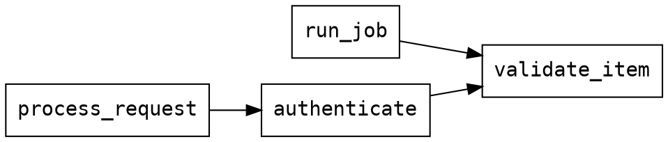

# Calls Adapter Guide (calls://)

**Adapter**: `calls://`
**Purpose**: Cross-file call graph queries — find callers of any function across your entire project
**Type**: Analysis adapter (project-level index)
**Output Formats**: text, json, dot (Graphviz)

## Table of Contents

1. [Quick Start](#quick-start)
2. [URI Syntax](#uri-syntax)
3. [How It Works](#how-it-works)
4. [Query Parameters](#query-parameters)
5. [Output Formats](#output-formats)
6. [Workflows](#workflows)
7. [Call Graph in ast://](#call-graph-in-ast)
8. [Limitations](#limitations)
9. [Performance & Caching](#performance-caching)
10. [FAQ](#faq)
11. [Related Documentation](#related-documentation)

---

## Quick Start

```bash
# Who calls validate_item anywhere in the project? (reverse lookup)
reveal 'calls://src/?target=validate_item'

# What does validate_item call? (forward lookup)
reveal 'calls://src/?callees=validate_item'

# Include callers-of-callers (2 levels deep)
reveal 'calls://src/?target=validate_item&depth=2'

# Graphviz dot output (pipe to dot for SVG/PNG)
reveal 'calls://src/?target=main&format=dot' | dot -Tsvg > call_graph.svg

# Within-file call graph (ast:// adapter — cheaper, no project index)
reveal 'ast://src/auth.py?show=calls'

# Find all callers of a function in a single file (within-file only)
reveal 'ast://src/auth.py?calls=validate_token'
```

**Why use calls://?**
- **Impact analysis**: Before changing a function, find all callers across the codebase
- **Understand behaviour**: Find what a function calls to trace its dependencies
- **Trace execution paths**: Follow call chains to understand how a feature triggers
- **Dead code detection**: A function with no callers may be unused
- **Visualize architecture**: Export call graphs to Graphviz for documentation

---

## URI Syntax

```
# Reverse lookup: who calls function X?
calls://<path>?target=<name>[&depth=N][&format=<fmt>]

# Forward lookup: what does function X call?
calls://<path>?callees=<name>[&format=<fmt>]
```

| Component | Description |
|-----------|-------------|
| `path` | Directory (or file) to index — typically `src/` or `.` |
| `target` | Function name to find **callers of** (reverse lookup) |
| `callees` | Function name to find **callees of** (forward lookup) |
| `depth` | Transitive levels for `?target` (default: 1, max: 5) |
| `format` | Output format: `text` (default), `json`, or `dot` (Graphviz) |

### Examples

```bash
# Direct callers of process_batch (reverse lookup)
reveal 'calls://src/?target=process_batch'

# What does process_batch call? (forward lookup)
reveal 'calls://src/?callees=process_batch'

# Callers-of-callers (2 levels)
reveal 'calls://src/?target=process_batch&depth=2'

# Full transitive tree (5 levels max)
reveal 'calls://src/?target=entry_point&depth=5'

# Graphviz for visual diagram
reveal 'calls://src/?target=main&format=dot' | dot -Tsvg > main_callers.svg

# JSON for programmatic use
reveal 'calls://src/?target=validate_item&format=json'

# Whole-project index (use . for current dir)
reveal 'calls://.?target=my_function'
```

---

## How It Works

The `calls://` adapter builds a **project-level callers index** from all code files under the given path:

1. **Collect structures** — runs the same analysis as `ast://` on every code file in the directory
2. **Build inverted index** — maps each callee name → list of (file, function, line) caller records
3. **Cache by mtime** — the index is cached per directory; any file change triggers a rebuild
4. **BFS traversal** — for `depth > 1`, performs a breadth-first walk up to `depth` levels of callers

```
callee → [(file, caller_func, line), ...]
```

**Callee normalisation**: `self.foo` is normalised to `foo` for lookup. The original call expression (`self.foo`) is preserved in the `call_expr` field of each result record.

---

## Query Parameters

| Parameter | Type | Default | Description |
|-----------|------|---------|-------------|
| `target` | string | — | Function name to find **callers of** (reverse lookup) |
| `callees` | string | — | Function name to find **callees of** (forward lookup) |
| `depth` | integer | 1 | Transitive levels for `?target` (1 = direct only, max 5) |
| `builtins` | boolean | `false` | Include Python builtins in `?callees` output (`len`, `str`, `sorted`, exceptions, etc.) |
| `format` | string | `text` | Output format: `text`, `json`, or `dot` |

> One of `target` or `callees` is required. If both are given, `callees` takes precedence.

### `target`

Reverse lookup — who calls this function? The bare function name, no file qualifier needed:

```bash
# Bare name (most common)
reveal 'calls://src/?target=validate_item'

# Method names work the same way
reveal 'calls://src/?target=process'
```

### `callees`

Forward lookup — what does this function call? Scans all definitions of the function name across the project:

```bash
# What does validate_item call? (builtins hidden by default)
reveal 'calls://src/?callees=validate_item'

# Include Python builtins (len, str, sorted, ValueError, open, eval, etc.)
reveal 'calls://src/?callees=validate_item&builtins=true'

# Useful when a function is defined in multiple files
reveal 'calls://src/?callees=handle_request'
```

Python builtins (`len`, `str`, `sorted`, `ValueError`, `open`, `print`, etc.) are hidden by default — they add noise without revealing project structure. Use `?builtins=true` when you specifically want to audit dangerous builtins like `eval`, `exec`, or `open`.

> Only applies to `?callees` (forward lookup). The `?target` (reverse lookup) is unaffected — callers of builtins are always shown.

### `depth`

Expands callers transitively. Level 1 = direct callers, level 2 = callers of those callers, etc.:

```bash
reveal 'calls://src/?target=validate_item&depth=1'   # default — direct callers
reveal 'calls://src/?target=validate_item&depth=2'   # direct + their callers
reveal 'calls://src/?target=validate_item&depth=5'   # up to 5 levels deep (capped)
```

---

## Output Formats

### Text (default)

Human-readable summary with relative file path, line, and caller context:

```
Callers of: validate_item
Project:    src/
Total:      3

  src/auth/handlers.py:42  authenticate  (calls validate_item)
  src/api/routes.py:78     process_request  (calls validate_item)
  src/worker/jobs.py:17    run_job  (calls self.validate_item)
```

> File paths are relative to the project root — not just the basename — so `auth/handlers.py` and `utils/handlers.py` are never confused.

With `depth=2`:

```
Callers of: validate_item
Project:    src/
Depth:      2
Total:      5

Direct callers:
  src/auth/handlers.py:42  authenticate  (calls validate_item)
  src/worker/jobs.py:17    run_job  (calls self.validate_item)

Level 2 callers:
  src/api/routes.py:78  process_request  (calls authenticate)
  src/main.py:12        main  (calls run_job)
```

When no callers are found:

```
Callers of: orphan_fn
Project:    src/
Total:      0

  No callers found for 'orphan_fn'.
```

**Callees text output** (`?callees=`):

```
Callees of: validate_item
Project:    src/
Total:      4 call(s) across 1 definition(s)

  src/auth/validators.py:55  validate_item
    → check_required
    → normalize_value
    → log_validation
    → raise_error

            (6 builtin(s) hidden — use ?builtins=true to include)
```

With `?builtins=true` the footer disappears and the full raw list (including `len`, `str`, `isinstance`, etc.) is shown. The footer only appears when at least one builtin was filtered.

When the function is not found:

```
Callees of: unknown_fn
Project:    src/
Total:      0 call(s) across 0 definition(s)

  No definition of 'unknown_fn' found.
```

### JSON

Structured data for programmatic processing:

```bash
reveal 'calls://src/?target=validate_item' --format=json
```

```json
{
  "contract_version": "1.1",
  "type": "calls_query",
  "source": "src/",
  "target": "validate_item",
  "depth": 1,
  "total_callers": 3,
  "levels": [
    {
      "level": 1,
      "callers": [
        {
          "file": "src/auth.py",
          "caller": "authenticate",
          "line": 42,
          "call_expr": "validate_item",
          "callee": "validate_item"
        },
        {
          "file": "src/worker.py",
          "caller": "run_job",
          "line": 17,
          "call_expr": "self.validate_item",
          "callee": "validate_item"
        }
      ]
    }
  ]
}
```

### Dot (Graphviz)

Directed graph format for visualisation:

```bash
# Text preview
reveal 'calls://src/?target=validate_item&format=dot'

# SVG
reveal 'calls://src/?target=main&format=dot' | dot -Tsvg > call_graph.svg

# PNG
reveal 'calls://src/?target=main&format=dot' | dot -Tpng > call_graph.png
```

Example dot output:



---

## Workflows

### Workflow 1: Impact Analysis Before Changing a Function

Before modifying a function, understand all callers to assess risk:

```bash
# Step 1: Direct callers
reveal 'calls://src/?target=parse_config'

# Step 2: Expand to understand full impact (transitive)
reveal 'calls://src/?target=parse_config&depth=3'

# Step 3: Extract files to review
reveal 'calls://src/?target=parse_config' --format=json | \
  jq -r '.levels[0].callers[].file' | sort -u
```

### Workflow 2: Find Unused Functions (Dead Code)

```bash
# Step 1: List all functions in the project
reveal 'ast://src/?type=function' --format=json | \
  jq -r '.results[].name' | sort > all_functions.txt

# Step 2: For each function, check if it has callers
while read fn; do
  count=$(reveal "calls://src/?target=$fn" --format=json | jq '.total_callers')
  if [ "$count" -eq 0 ]; then
    echo "UNUSED: $fn"
  fi
done < all_functions.txt
```

### Workflow 3: Trace an Execution Path

Starting from an entry point, trace who it calls and what calls it:

```bash
# Who calls the entry point?
reveal 'calls://src/?target=handle_request'

# What does handle_request call? (use ast://)
reveal 'ast://src/?callee_of=handle_request'

# Or see everything handle_request calls
reveal 'ast://src/handler.py?calls=*' --format=json | jq '.results[] | select(.called_by | contains(["handle_request"]))'
```

### Workflow 4: Generate Architecture Documentation

```bash
# Visual call graph for documentation
reveal 'calls://src/?target=main&depth=3&format=dot' | \
  dot -Tsvg -Grankdir=TB > architecture.svg

# JSON for custom visualisation
reveal 'calls://src/?target=main&depth=5' --format=json > call_tree.json
```

### Workflow 5: Verify Refactoring

After extracting a function, confirm the old callers now use the new name:

```bash
# Check old name has no callers
reveal 'calls://src/?target=old_parse_config'

# Check new name has callers
reveal 'calls://src/?target=parse_config'
```

### Workflow 6: Understand What a Function Does (Forward Lookup)

Before reviewing or debugging a function, see what it delegates to:

```bash
# What does process_request call?
reveal 'calls://src/?callees=process_request'

# Useful for understanding a function you've never seen before
reveal 'calls://src/?callees=initialize_app'
```

This is faster than reading the full implementation when you just want to know the collaboration pattern — what it orchestrates, not how.

---

## Call Graph in ast://

For within-file analysis, `ast://` provides lighter-weight call graph features without building a project index:

| Feature | `ast://` | `calls://` |
|---------|---------|-----------|
| Scope | Within a single file | Across the whole project |
| `calls` outgoing | ✅ (via JSON or text renderer) | ✅ `?callees=<name>` (forward lookup) |
| `called_by` incoming | ✅ within-file reverse | ✅ `?target=<name>` (full project) |
| Filters | `calls=<name>`, `callee_of=<name>` | `target=<name>`, `callees=<name>` |
| Display mode | `show=calls` (arrow diagram) | text / json / dot |
| Cross-file resolution | `resolved_calls[]` in JSON | full index |
| Cache | No (per-request) | Yes (mtime-based) |

**Use `ast://` when:**
- You're already inspecting a single file and want to see call structure inline
- You want to filter functions by what they call (`calls=validate*`)
- You want a quick call graph diagram for a file (`show=calls`)

**Use `calls://` when:**
- You need to know all callers across the entire project
- You need transitive call chains (`depth > 1`)
- You want Graphviz output for documentation
- You're doing impact analysis before changing a function

### ast:// call graph examples

```bash
# Show calls/called_by for every function (arrow diagram)
reveal 'ast://src/auth.py?show=calls'

# Find functions calling validate_token
reveal 'ast://src/?calls=validate_token'

# Find functions called by main
reveal 'ast://src/?callee_of=main'

# JSON: get calls + resolved_calls for a specific function
reveal 'ast://src/auth.py?name=authenticate' --format=json | \
  jq '.results[0] | {calls, called_by, resolved_calls}'
```

---

## Limitations

**Static analysis only.** The following patterns are not resolved:

- **Dynamic dispatch** — `getattr(obj, method_name)()`, callback tables, metaclasses
- **Method resolution order (MRO)** — `super().method()` is tracked as `method`, not resolved to a specific parent class
- **Lambdas and closures** — may appear in calls list but context is limited
- **Runtime-generated names** — `importlib.import_module()`, `__import__()`

**Scope is per-directory.** The index is built from `path` downward. Callers above the given path are not visible:

```bash
reveal 'calls://src/?target=fn'   # won't see callers in tests/ above src/
reveal 'calls://.?target=fn'       # use project root for full coverage
```

**`called_by` in `ast://` is within-file only.** If a function has callers only in other files, `called_by` will be empty in `ast://` output. The `calls://` adapter is the authoritative source for cross-file callers.

**Language support.** Call extraction relies on tree-sitter analyzers. Python has the best support. JS/TS/Go/Rust work but have shallower call extraction for complex expressions.

---

## Performance & Caching

The project-level index is cached in memory per process per directory:

- **Cache key**: frozenset of `(file_path, mtime_ns)` for all code files in the directory
- **Invalidation**: any file change (add, modify, delete) causes a full rebuild on next query
- **Rebuild cost**: proportional to number of functions × average calls per function — fast in practice, even for large codebases

For very large codebases (100K+ lines), point at a subdirectory:

```bash
# Faster — only indexes auth/ module
reveal 'calls://src/auth/?target=validate_token'

# Full project — slower first run, cached after
reveal 'calls://src/?target=validate_token'
```

---

## FAQ

**Q: What if `target` is a common name used in many places?**

A: The index returns all files that call it. Use JSON output and filter by file if needed:

```bash
reveal 'calls://src/?target=process' --format=json | \
  jq '.levels[0].callers[] | select(.file | contains("auth"))'
```

**Q: Can I search for method calls like `obj.method()`?**

A: Yes. The index normalises `self.foo` → `foo` for lookup. Pass the bare method name:

```bash
reveal 'calls://src/?target=validate'   # matches self.validate(), obj.validate(), validate()
```

The `call_expr` field in results preserves the original form (`self.validate_item`).

**Q: The function exists but `total_callers` is 0. Is something wrong?**

A: A few possibilities:
- The function is never called (genuine dead code)
- It's called only from outside the indexed path — try `calls://.?target=fn`
- It's called via dynamic dispatch (not statically resolvable)
- The caller is in a file type not indexed (e.g., `.yaml` or `.sh`)

**Q: How do I find all functions that are never called (dead code)?**

A: There's no built-in filter yet. Use the shell loop pattern from Workflow 2 above, or check `called_by` from `ast://` as a quick heuristic for within-file isolation.

**Q: How do I audit code for dangerous builtins like `eval` or `open`?**

A: Use `?builtins=true` on a `?callees=` query to include builtins in the output, then grep:

```bash
# Find every function that calls eval
reveal 'calls://src/?callees=process_input&builtins=true' | grep 'eval'

# Or scan callers of eval directly (reverse lookup — always includes builtins)
reveal 'calls://src/?target=eval'
```

The `?target=` direction (reverse lookup) always returns results regardless of `?builtins` — builtins filtering only applies to the forward `?callees=` direction.

**Q: Is `calls://` the same as a full call graph tool like pycallgraph or pyCallGraph?**

A: No — `calls://` is a fast static analysis tool built on the same parse trees as `ast://`. It doesn't execute code, doesn't track dynamic dispatch, and doesn't generate flame graphs. For profiling and runtime call graphs, use profiling tools. For structural analysis, refactoring, and impact assessment, `calls://` is faster and doesn't require a running application.

---

## Related Documentation

- [`AST_ADAPTER_GUIDE.md`](AST_ADAPTER_GUIDE.md) — `ast://` adapter, including within-file call graph features (`calls=`, `callee_of=`, `show=calls`)
- [`IMPORTS_ADAPTER_GUIDE.md`](IMPORTS_ADAPTER_GUIDE.md) — import graph analysis (`imports://`)
- [`AGENT_HELP.md`](AGENT_HELP.md) — complete agent workflow reference including call graph task patterns
- `internal-docs/design/CALL_GRAPH_DESIGN.md` — implementation design document (maintainer reference, not in published docs)
