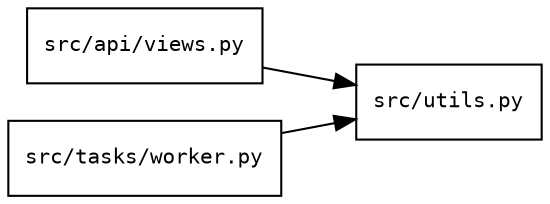

# Depends Adapter Guide (depends://)

**Adapter**: `depends://`
**Purpose**: Reverse module dependency graph — find everything that imports a given module
**Type**: Analysis adapter (project-level index)
**Output Formats**: text, json, dot (Graphviz)

## Table of Contents

1. [Quick Start](#quick-start)
2. [URI Syntax](#uri-syntax)
3. [How It Works](#how-it-works)
4. [Query Parameters](#query-parameters)
5. [Output Formats](#output-formats)
6. [Workflows](#workflows)
7. [Relationship to imports://](#relationship-to-imports)
8. [Limitations](#limitations)
9. [FAQ](#faq)
10. [Related Documentation](#related-documentation)

---

## Quick Start

```bash
# Who imports utils.py? (anywhere in the project)
reveal depends://src/utils.py

# Everything that imports any module in models/
reveal depends://src/models/

# Top 10 most-imported modules (high-coupling candidates)
reveal 'depends://src?top=10'

# Full reverse dependency graph in GraphViz DOT format
reveal 'depends://src?format=dot' | dot -Tsvg > depends_graph.svg
```

**Why use depends://?**
- **Impact analysis**: Before changing a module, find every file that will be affected
- **Refactoring safety**: Know what breaks if you move or rename a module
- **Coupling metrics**: High dependent counts signal fragile modules — refactor candidates
- **Dead code detection**: A module with no dependents may be unused
- **Architecture documentation**: Visualize the dependency structure of your codebase

---

## URI Syntax

```
# Find all importers of a specific file
depends://<file.py>

# Summarize all reverse edges in a directory
depends://<directory/>[?top=N][?format=dot]
```

| Component | Description |
|-----------|-------------|
| `path` | File (returns importers of that file) or directory (returns summary) |
| `top` | Limit directory summary to N most-imported modules |
| `format` | Output format: `text` (default), `json`, or `dot` (Graphviz) |

### File vs Directory

| Target | Output type | What you get |
|--------|-------------|--------------|
| `depends://src/utils.py` | `module_dependents` | Every file that imports `utils.py`, with line numbers |
| `depends://src/models/` | `dependency_summary` | All modules in `models/` ranked by how many files import them |

---

## How It Works

`depends://` builds the same import graph as `imports://` but queries it in **reverse**.

1. Scans from the project root (detected via `pyproject.toml`, `setup.py`, `.git`, etc.)
2. Extracts all import statements across supported languages
3. Resolves relative imports to absolute paths
4. Inverts the graph: for each `A imports B`, records `B has dependent A`
5. Returns the dependent set for the requested target

The full project scan makes the results comprehensive — callers outside the target directory are still found.

---

## Query Parameters

### `top`

Limit directory summary to the N most-imported modules. Useful for finding high-coupling candidates.

```bash
reveal 'depends://src?top=5'
reveal 'depends://src?top=20'
```

### `format`

Output format for directory mode:

```bash
reveal 'depends://src?format=dot'    # GraphViz DOT (pipe to dot/graphviz)
reveal 'depends://src?format=text'   # Default text table
```

---

## Output Formats

### Text (default)

**File target** — lists every importer with file, line, and what was imported:

```
============================================================
Dependents of: src/utils.py
============================================================

  3 file(s) import this module:

  src/api/views.py:12    ← format_response, validate_input
  src/tasks/worker.py:8  ← format_response
  tests/test_utils.py:4  ← *
```

**Directory target** — sorted table of modules by dependent count:

```
============================================================
Reverse Dependency Summary: src/models/
============================================================

  5 module(s) imported internally (12 total import edges)

    4  ████  src/models/user.py
    3  ███   src/models/post.py
    3  ███   src/models/base.py
    1  █     src/models/tag.py
    1  █     src/models/audit.py
```

### JSON

```bash
reveal depends://src/utils.py --format=json
```

File target output schema:
```json
{
  "contract_version": "1.0",
  "type": "module_dependents",
  "target": "/abs/path/src/utils.py",
  "count": 3,
  "dependents": [
    {
      "file": "src/api/views.py",
      "line": 12,
      "module": "src.utils",
      "names": ["format_response", "validate_input"],
      "type": "named_import",
      "is_relative": false,
      "alias": null
    }
  ]
}
```

Directory target output schema:
```json
{
  "contract_version": "1.0",
  "type": "dependency_summary",
  "source": "/abs/path/src/models/",
  "modules": [
    {
      "module": "/abs/path/src/models/user.py",
      "dependent_count": 4,
      "dependents": ["src/api/views.py", "src/tasks/worker.py", ...]
    }
  ]
}
```

### Dot (Graphviz)

```bash
reveal 'depends://src?format=dot' | dot -Tsvg > depends.svg
reveal 'depends://src?format=dot' | dot -Tpng > depends.png
```

Produces a directed graph where arrows point from importer to importee:



---

## Workflows

### Workflow 1: Impact Analysis Before Refactoring

Before moving, renaming, or changing a module's API:

```bash
# Step 1: See who depends on the file
reveal depends://src/auth/tokens.py

# Step 2: If many dependents, check what specifically they import
reveal depends://src/auth/tokens.py --format=json | jq '.dependents[].names'

# Step 3: Check if any are across package boundaries (harder to fix)
reveal depends://src/auth/tokens.py --format=json | \
  jq -r '.dependents[].file' | sort
```

### Workflow 2: Find High-Coupling Modules

High dependent counts mean a change there touches many files:

```bash
# Find your most-imported modules
reveal 'depends://src?top=20'

# Deep dive on the top result
reveal depends://src/most_imported.py
```

Modules with many dependents are natural candidates for extraction into stable utility libraries, or for extra care when changing.

### Workflow 3: Dead Code Detection

A module with no dependents (inside the project) may be unused:

```bash
# Check all modules in a directory
reveal 'depends://src'

# Modules not in the list have 0 dependents
# Cross-check: are they entry points? (CLI scripts, __main__.py)
# If not, they may be dead code
```

### Workflow 4: Architecture Documentation

Generate a full dependency map for architecture review or onboarding:

```bash
# Full graph for docs
reveal 'depends://src?format=dot' | dot -Tsvg -o architecture.svg

# Top-level only (less noise)
reveal 'depends://src?top=15&format=dot' | dot -Tsvg -o arch_toplevel.svg
```

### Workflow 5: Verify a Refactoring Is Complete

After breaking a circular dependency or extracting a module:

```bash
# Before: check what imported old_module.py
reveal depends://src/old_module.py

# After splitting into module_a.py and module_b.py:
reveal depends://src/module_a.py
reveal depends://src/module_b.py
# Verify old_module.py now has 0 dependents (or the expected ones)
```

---

## Relationship to imports://

`depends://` and `imports://` are two views of the same graph:

| Adapter | Question answered | Direction |
|---------|-------------------|-----------|
| `imports://src/a.py` | What does `a.py` import? | Forward (a → b, c, d) |
| `depends://src/a.py` | What imports `a.py`? | Reverse (x, y, z → a) |

Use `imports://` to understand a module's dependencies. Use `depends://` to understand its impact radius.

```bash
# Forward: what does auth.py need?
reveal imports://src/auth.py

# Reverse: what needs auth.py?
reveal depends://src/auth.py
```

---

## Limitations

**Dynamic imports not tracked**: `importlib.import_module()`, `__import__()`, and string-based imports are not detected. The graph is conservative — no false positives, but some dynamic callers will be missed.

**TYPE_CHECKING imports excluded**: Imports under `if TYPE_CHECKING:` are intentionally excluded. These are type-hint-only and don't create runtime dependencies.

**Name-based resolution**: Imports are resolved to file paths. If two files export the same name, resolution may be ambiguous. Relative imports are resolved correctly; absolute imports use project root detection.

**Language support**: Same as `imports://`. Run `reveal depends://src --format=json | jq '.metadata'` to see the scan result. Language support is determined by available import extractors — Python is fully supported; support for other languages depends on extractor availability.

---

## FAQ

**Q: Why does `depends://` scan the whole project instead of just the target directory?**

A: To find all importers. If `api/views.py` imports `utils/helpers.py`, running `depends://utils/helpers.py` needs to see `api/views.py`. Scanning from the project root ensures no importers are missed.

**Q: I got 0 dependents for a module I know is imported.**

A: Check: (1) Is the import under `if TYPE_CHECKING:`? Those are excluded. (2) Is it a dynamic import (`importlib`)? Those are not tracked. (3) Is the project root detected correctly? Try running from the project root.

**Q: How does depends:// relate to the `--verbose` flag?**

A: `--verbose` on a file target expands the dependent listing to show full import detail. Without `--verbose`, each file is shown on one line; with `--verbose`, each import statement is shown separately.

**Q: Can I use depends:// in a pipeline?**

A: Yes — `--format=json` produces machine-readable output suitable for `jq` filtering:
```bash
reveal depends://src/auth.py --format=json | jq -r '.dependents[].file'
```

---

## Related Documentation

- [IMPORTS_ADAPTER_GUIDE.md](IMPORTS_ADAPTER_GUIDE.md) — forward dependency graph (what a module imports)
- [CALLS_ADAPTER_GUIDE.md](CALLS_ADAPTER_GUIDE.md) — reverse call graph (who calls a function)
- [AST_ADAPTER_GUIDE.md](AST_ADAPTER_GUIDE.md) — within-file call graph via `ast://`
- [RECIPES.md](../guides/RECIPES.md) — multi-adapter workflow patterns
- [AGENT_HELP.md](../AGENT_HELP.md) — complete AI agent reference
